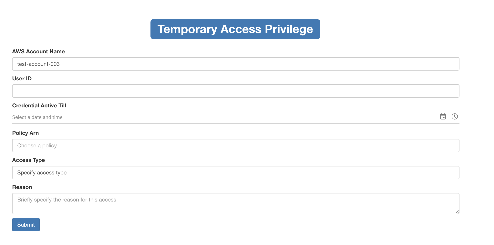
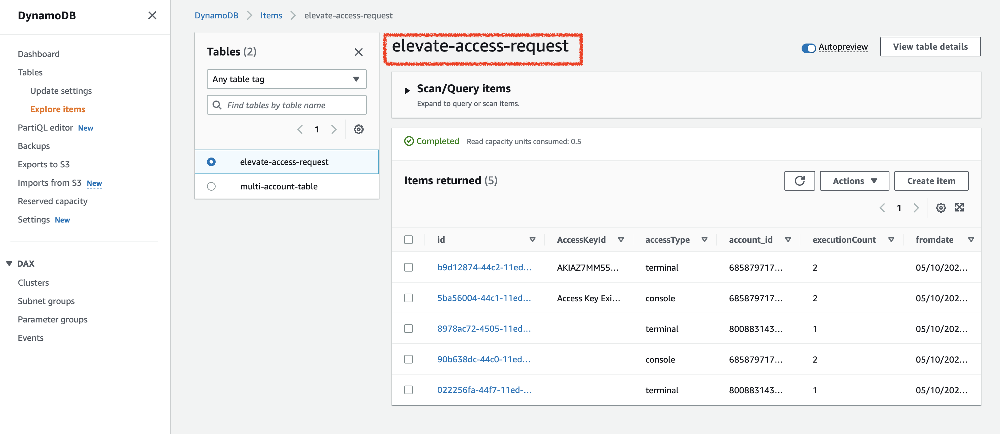
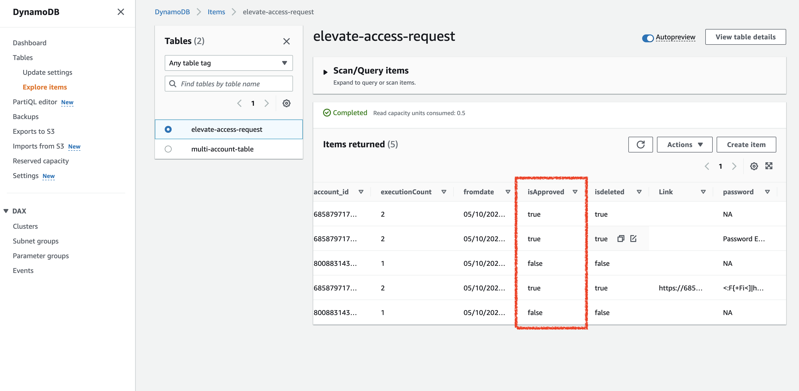
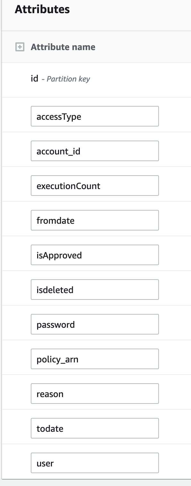
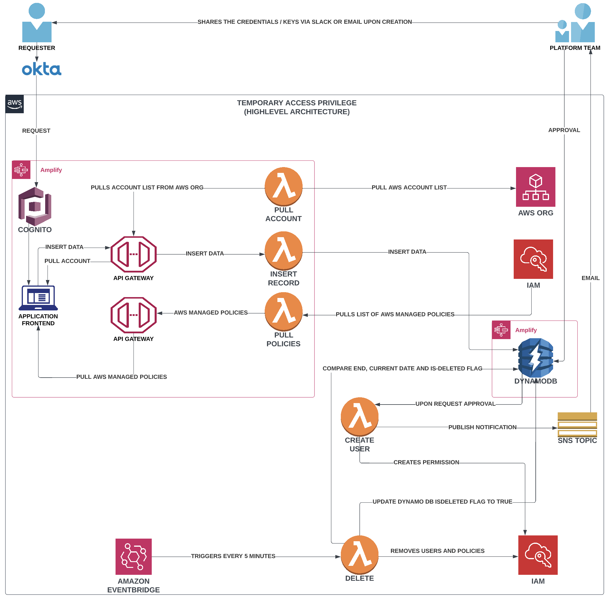
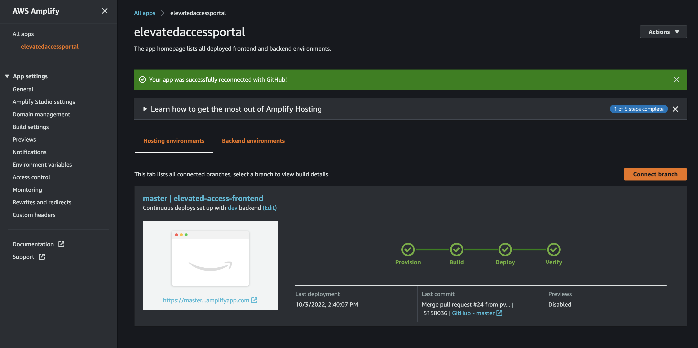

## About 

`Temporary Access Privilege` or `TAP Request Portal` is a serverless solution that is developed with an intention to provide a self-service portal to facilitate IAM user creation and attach specific permissions for a certain period of time on accounts in an AWS Organization. There is a frontend which takes the input and stores it in the backend database. The access ia granted upon approval and review and respective notifications are sent.
There is a lambda function that keeps checking for stale IAM users and deletes them from the specific account upon expiry.
The above lambda function is scheduled using an `AWS EventBridge` that triggers a lambda at every 5 minutes to scan the DynamoDB to delete IAM users based on their access end date.
Using this application user can request for both `Terminal` and `Console` access

**NOTE:** This repository has the code to set-up the application from scratch which includes both the frontend and the lambda functions. For this project `AWS Amplify` service can be used set-up storage, api endpoints and lamnbdas. The architecture can be referred for the initial set-up.

## Frontend



## Authentication

The application is integrated with AWS Cognito and Okta for Authnetication.

## Implementation 

- The user request to create a new IAM user from a React-JS  based frontend form. 
- On submit the details gets stored in `DynamoDB` a No-SQL database using a `Lambda Function` via `API Gateway`
- The above `INSERT` event in the database triggers another Lambda Function that publishes a message to the `SNS Topic`
- Admin team subscribed to the `SNS Topic` receives the notification of the new request.
- Ideally there should be another portal for providing approval on new requests, but till we have one - admin team can access the `DynamoDB` either using some `DynamoDB` third party client or directly login to the database and provide approval for the request.
- The approver needs to update the `isApproved` field in `DynamoDB` from `false` to `true` upon review.
- Upon approval another lambda function kicks in and creates the iam user , creates login profile and generate login crdentials in cases where the access type is for `console` OR `aws_access_key_id` and `aws_secret_access_key` where request is for access type as `terminal.` 
- The credentials are generated and inserted in the same `DynamoDB` table and an alert gets triggered to Platform Team with the credentials / keys as per the initial request.
- If the same user wants to request a new policy, he or she can put the request via the frontend portal and upon approval the lambda function just attaches the policy to the exisiting user.
- When the iam profile expires as per the initial provided access timeframe, a lambda function kicks in and removes the IAM user from specific account and marks `isdeleted` field in DynamoDB as `true`.

## DynamoDB - For Approvals

- To approve the request please mark the `isApproved` flag as `true` in DynamoDB Table `elevate-access-request` inside AWS Account  `us-east-1`




## DynamoDB - Attributes



## NOTE:

- The `delete` lambda function to clean stale iam profiles might take a while to finish execution as I have used `sleep()` in few methods. This is done to prevent threading issues which may occur for large datasets when application runs on a single thread.
- The `Policy Arn` dropdown is deployed in the master account which dynamically pulls all policies available. Please pay attention while selecting the desired policy arn option as some policies are specific to the master account only. 
- The Application resides in main AWS Organization account and has visibility to all child account.
- The lambda functions in the application assumes role in the child account based on the IAM user creation request.
- The dropdowns in the UI might take few seconds to load as it fetches data dynamically using backend lambda on page load.
- User needs to get themselves subscribed to the `SNS Topic` for emails upon credential generation or have to request platform team to share it with them. This process might change in subsequent versions. 

## Resources 

The project is build in Test Organization Account - #534669164359 and below are the resources used and deployed using AWS Amplify. 
```
┌──────────┬──────────────────────────────────┬───────────┬───────────────────┐
│ Category │ Resource name                    │ Operation │ Provider plugin   │
├──────────┼──────────────────────────────────┼───────────┼───────────────────┤
│ Function │ elevatedaccesspullaccountslambda │ Create    │ awscloudformation │
├──────────┼──────────────────────────────────┼───────────┼───────────────────┤
│ Function │ elevatedaccessinsertdata         │ Create    │ awscloudformation │
├──────────┼──────────────────────────────────┼───────────┼───────────────────┤
│ Function │ elevatedaccesspullpolicies       │ Create    │ awscloudformation │
├──────────┼──────────────────────────────────┼───────────┼───────────────────┤
│ Api      │ elevatedaccessapi                │ Create    │ awscloudformation │
├──────────┼──────────────────────────────────┼───────────┼───────────────────┤
│ Api      │ elevatedaccesspullpoliciesapi    │ Create    │ awscloudformation │
├──────────┼──────────────────────────────────┼───────────┼───────────────────┤
│ Auth     │ elevatedaccessportale4ac5dff     │ Create    │ awscloudformation │
├──────────┼──────────────────────────────────┼───────────┼───────────────────┤
│ Hosting  │ amplifyhosting                   │ Create    │                   │
└──────────┴──────────────────────────────────┴───────────┴───────────────────┘
```
There is a separate lambda function `elevated-access-create-user` and an event bridge rule `elevated-access-delete-trigger` for creation iam profile upon approval and to trigger delete lambda function upon profile expiry.

## Architecture



## Structure:

- The React Frontend sits in `elevated-access-frontend` directory and is deployed using AWS Amplify.
- For any lambda changes apart from `elevated-access-create-user` and `elevated-access-delete-user` needs to be done via amplify inside `backend`->`function`
- I removed the amplify directory inside `elevated-access-frontend` as it had my account specific config, however it can be initiated foloowing the reference [amplify docs](https://docs.amplify.aws/start/getting-started/installation/q/integration/react/) 
```
.
├── CHANGELOG.md
├── README.md
├── create-iam-user-publish-creds
│   ├── create_package.sh
│   ├── create_user.py
│   └── lambda_function.py
├── delete-expired-login-profiles
│   └── lambda_function.py
├── elevated-access-frontend
│   ├── README.md
│   ├── amplify
│   │   ├── #current-cloud-backend
│   │   │   ├── amplify-meta.json
│   │   │   ├── api
│   │   │   │   ├── elevatedaccessapi
│   │   │   │   │   ├── build
│   │   │   │   │   │   ├── elevatedaccessapi-cloudformation-template.json
│   │   │   │   │   │   └── parameters.json
│   │   │   │   │   └── cli-inputs.json
│   │   │   │   └── elevatedaccesspullpoliciesapi
│   │   │   │       ├── build
│   │   │   │       │   ├── elevatedaccesspullpoliciesapi-cloudformation-template.json
│   │   │   │       │   └── parameters.json
│   │   │   │       └── cli-inputs.json
│   │   │   ├── auth
│   │   │   ├── awscloudformation
│   │   │   │   └── build
│   │   │   │       ├── api
│   │   │   │       │   ├── elevatedaccessapi
│   │   │   │       │   │   └── build
│   │   │   │       │   │       └── elevatedaccessapi-cloudformation-template.json
│   │   │   │       │   ├── elevatedaccesspullaccounts
│   │   │   │       │   │   └── build
│   │   │   │       │   │       └── elevatedaccesspullaccounts-cloudformation-template.json
│   │   │   │       │   └── elevatedaccesspullpoliciesapi
│   │   │   │       │       └── build
│   │   │   │       │           └── elevatedaccesspullpoliciesapi-cloudformation-template.json
│   │   │   │       ├── auth
│   │   │   │       │   └── elevatedaccessportal
│   │   │   │       │       └── build
│   │   │   │       │           └── elevatedaccessportal-cloudformation-template.json
│   │   │   │       ├── awscloudformation
│   │   │   │       │   └── build
│   │   │   │       │       └── root-cloudformation-stack.json
│   │   │   │       ├── function
│   │   │   │       │   ├── elevatedaccessinsertdata
│   │   │   │       │   │   └── elevatedaccessinsertdata-cloudformation-template.json
│   │   │   │       │   ├── elevatedaccesspullaccountslambda
│   │   │   │       │   │   └── elevatedaccesspullaccountslambda-cloudformation-template.json
│   │   │   │       │   └── elevatedaccesspullpolicies
│   │   │   │       │       └── elevatedaccesspullpolicies-cloudformation-template.json
│   │   │   │       └── root-cloudformation-stack.json
│   │   │   ├── backend-config.json
│   │   │   ├── function
│   │   │   │   ├── elevatedaccessinsertdata
│   │   │   │   │   ├── Pipfile
│   │   │   │   │   ├── Pipfile.lock
│   │   │   │   │   ├── amplify.state
│   │   │   │   │   ├── custom-policies.json
│   │   │   │   │   ├── elevatedaccessinsertdata-cloudformation-template.json
│   │   │   │   │   ├── function-parameters.json
│   │   │   │   │   └── src
│   │   │   │   │       ├── event.json
│   │   │   │   │       ├── index.py
│   │   │   │   │       ├── setup.py
│   │   │   │   │       └── src.egg-info
│   │   │   │   │           ├── PKG-INFO
│   │   │   │   │           ├── SOURCES.txt
│   │   │   │   │           ├── dependency_links.txt
│   │   │   │   │           └── top_level.txt
│   │   │   │   ├── elevatedaccesspullaccountslambda
│   │   │   │   │   ├── Pipfile
│   │   │   │   │   ├── Pipfile.lock
│   │   │   │   │   ├── amplify.state
│   │   │   │   │   ├── custom-policies.json
│   │   │   │   │   ├── elevatedaccesspullaccountslambda-cloudformation-template.json
│   │   │   │   │   ├── function-parameters.json
│   │   │   │   │   └── src
│   │   │   │   │       ├── event.json
│   │   │   │   │       ├── index.py
│   │   │   │   │       ├── setup.py
│   │   │   │   │       └── src.egg-info
│   │   │   │   │           ├── PKG-INFO
│   │   │   │   │           ├── SOURCES.txt
│   │   │   │   │           ├── dependency_links.txt
│   │   │   │   │           └── top_level.txt
│   │   │   │   └── elevatedaccesspullpolicies
│   │   │   │       ├── Pipfile
│   │   │   │       ├── Pipfile.lock
│   │   │   │       ├── amplify.state
│   │   │   │       ├── custom-policies.json
│   │   │   │       ├── dist
│   │   │   │       │   └── latest-build.zip
│   │   │   │       ├── elevatedaccesspullpolicies-cloudformation-template.json
│   │   │   │       ├── function-parameters.json
│   │   │   │       └── src
│   │   │   │           ├── build
│   │   │   │           │   ├── bdist.macosx-10.14-x86_64
│   │   │   │           │   └── lib
│   │   │   │           │       └── index.py
│   │   │   │           ├── event.json
│   │   │   │           ├── index.py
│   │   │   │           ├── setup.py
│   │   │   │           └── src.egg-info
│   │   │   │               ├── PKG-INFO
│   │   │   │               ├── SOURCES.txt
│   │   │   │               ├── dependency_links.txt
│   │   │   │               └── top_level.txt
│   │   │   ├── hosting
│   │   │   │   └── amplifyhosting
│   │   │   └── tags.json
│   │   ├── README.md
│   │   ├── backend
│   │   │   ├── amplify-meta.json
│   │   │   ├── api
│   │   │   │   ├── elevatedaccessapi
│   │   │   │   │   ├── build
│   │   │   │   │   │   ├── elevatedaccessapi-cloudformation-template.json
│   │   │   │   │   │   └── parameters.json
│   │   │   │   │   └── cli-inputs.json
│   │   │   │   └── elevatedaccesspullpoliciesapi
│   │   │   │       ├── build
│   │   │   │       │   ├── elevatedaccesspullpoliciesapi-cloudformation-template.json
│   │   │   │       │   └── parameters.json
│   │   │   │       └── cli-inputs.json
│   │   │   ├── auth
│   │   │   ├── awscloudformation
│   │   │   │   └── build
│   │   │   │       ├── api
│   │   │   │       │   ├── elevatedaccessapi
│   │   │   │       │   │   └── build
│   │   │   │       │   │       └── elevatedaccessapi-cloudformation-template.json
│   │   │   │       │   ├── elevatedaccesspullaccounts
│   │   │   │       │   │   └── build
│   │   │   │       │   │       └── elevatedaccesspullaccounts-cloudformation-template.json
│   │   │   │       │   └── elevatedaccesspullpoliciesapi
│   │   │   │       │       └── build
│   │   │   │       │           └── elevatedaccesspullpoliciesapi-cloudformation-template.json
│   │   │   │       ├── auth
│   │   │   │       │   └── elevatedaccessportal
│   │   │   │       │       └── build
│   │   │   │       │           └── elevatedaccessportal-cloudformation-template.json
│   │   │   │       ├── awscloudformation
│   │   │   │       │   └── build
│   │   │   │       │       └── root-cloudformation-stack.json
│   │   │   │       ├── function
│   │   │   │       │   ├── elevatedaccessinsertdata
│   │   │   │       │   │   └── elevatedaccessinsertdata-cloudformation-template.json
│   │   │   │       │   ├── elevatedaccesspullaccountslambda
│   │   │   │       │   │   └── elevatedaccesspullaccountslambda-cloudformation-template.json
│   │   │   │       │   └── elevatedaccesspullpolicies
│   │   │   │       │       └── elevatedaccesspullpolicies-cloudformation-template.json
│   │   │   │       └── root-cloudformation-stack.json
│   │   │   ├── backend-config.json
│   │   │   ├── function
│   │   │   │   ├── elevatedaccessinsertdata
│   │   │   │   │   ├── Pipfile
│   │   │   │   │   ├── Pipfile.lock
│   │   │   │   │   ├── amplify.state
│   │   │   │   │   ├── custom-policies.json
│   │   │   │   │   ├── dist
│   │   │   │   │   │   └── latest-build.zip
│   │   │   │   │   ├── elevatedaccessinsertdata-cloudformation-template.json
│   │   │   │   │   ├── function-parameters.json
│   │   │   │   │   └── src
│   │   │   │   │       ├── build
│   │   │   │   │       │   ├── bdist.macosx-10.14-x86_64
│   │   │   │   │       │   └── lib
│   │   │   │   │       │       └── index.py
│   │   │   │   │       ├── event.json
│   │   │   │   │       ├── index.py
│   │   │   │   │       ├── setup.py
│   │   │   │   │       └── src.egg-info
│   │   │   │   │           ├── PKG-INFO
│   │   │   │   │           ├── SOURCES.txt
│   │   │   │   │           ├── dependency_links.txt
│   │   │   │   │           └── top_level.txt
│   │   │   │   ├── elevatedaccesspullaccountslambda
│   │   │   │   │   ├── Pipfile
│   │   │   │   │   ├── Pipfile.lock
│   │   │   │   │   ├── amplify.state
│   │   │   │   │   ├── custom-policies.json
│   │   │   │   │   ├── dist
│   │   │   │   │   │   └── latest-build.zip
│   │   │   │   │   ├── elevatedaccesspullaccountslambda-cloudformation-template.json
│   │   │   │   │   ├── function-parameters.json
│   │   │   │   │   └── src
│   │   │   │   │       ├── build
│   │   │   │   │       │   ├── bdist.macosx-10.14-x86_64
│   │   │   │   │       │   └── lib
│   │   │   │   │       │       └── index.py
│   │   │   │   │       ├── event.json
│   │   │   │   │       ├── index.py
│   │   │   │   │       ├── setup.py
│   │   │   │   │       └── src.egg-info
│   │   │   │   │           ├── PKG-INFO
│   │   │   │   │           ├── SOURCES.txt
│   │   │   │   │           ├── dependency_links.txt
│   │   │   │   │           └── top_level.txt
│   │   │   │   └── elevatedaccesspullpolicies
│   │   │   │       ├── Pipfile
│   │   │   │       ├── Pipfile.lock
│   │   │   │       ├── amplify.state
│   │   │   │       ├── custom-policies.json
│   │   │   │       ├── dist
│   │   │   │       │   └── latest-build.zip
│   │   │   │       ├── elevatedaccesspullpolicies-cloudformation-template.json
│   │   │   │       ├── function-parameters.json
│   │   │   │       └── src
│   │   │   │           ├── build
│   │   │   │           │   ├── bdist.macosx-10.14-x86_64
│   │   │   │           │   └── lib
│   │   │   │           │       └── index.py
│   │   │   │           ├── event.json
│   │   │   │           ├── index.py
│   │   │   │           ├── setup.py
│   │   │   │           └── src.egg-info
│   │   │   │               ├── PKG-INFO
│   │   │   │               ├── SOURCES.txt
│   │   │   │               ├── dependency_links.txt
│   │   │   │               └── top_level.txt
│   │   │   ├── hosting
│   │   │   │   └── amplifyhosting
│   │   │   ├── tags.json
│   │   │   └── types
│   │   │       └── amplify-dependent-resources-ref.d.ts
│   │   ├── cli.json
│   │   ├── hooks
│   │   │   ├── README.md
│   │   │   ├── post-push.sh.sample
│   │   │   └── pre-push.js.sample
│   │   └── team-provider-info.json
│   ├── package-lock.json
│   ├── package.json
│   ├── public
│   │   ├── favicon.ico
│   │   ├── index.html
│   │   ├── logo192.png
│   │   ├── logo512.png
│   │   ├── manifest.json
│   │   └── robots.txt
│   ├── src
│   │   ├── App.css
│   │   ├── App.js
│   │   ├── App.test.js
│   │   ├── aws-exports.js
│   │   ├── index.css
│   │   ├── index.js
│   │   ├── logo.svg
│   │   ├── ui-logo.png
│   │   ├── reportWebVitals.js
│   │   └── setupTests.js
│   ├── yarn-error.log
│   └── yarn.lock
├── elevated-access-pull-policies
│   └── lambda_function.py
├── experiment.py
├── images
│   └── aws-architecture.png
├── insert-records-to-dynamodb
│   └── lambda_function.py
├── pull-accounts-from-awsorg
│   └── lambda_function.py
└── re-arch
    ├── pull-permissions-from-sso
    │   └── lambda_function.py
    ├── update-publish-create-permission
    │   └── lambda_function.py
    └── update-publish-removes-permission
        └── lambda_function.py

```
## Deployment CI-CD  



## References

- [AWS Amplify](https://docs.amplify.aws/start/getting-started/installation/q/integration/react/)
- [Boto3](https://boto3.amazonaws.com/v1/documentation/api/latest/guide/quickstart.html)

## Developer

- [Ranopriyo Neogy](https://github.com/ranopriyo-neogy)
